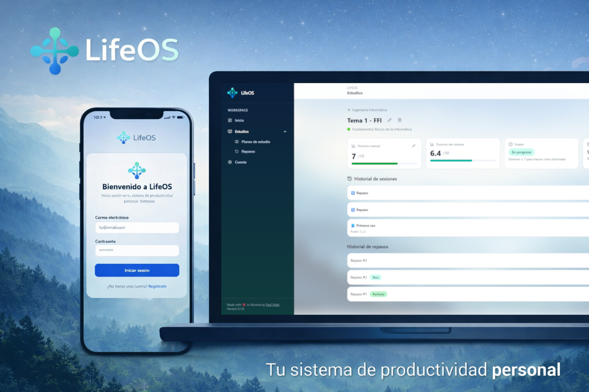

# LifeOS

<p align="center">
  
</p>

<div align="center">

### Tu sistema operativo personal para estudiar y vivir con claridad

_Un solo lugar para planificar, ejecutar y mejorar tu progreso real._

</div>

---

## La idea detrás de LifeOS

La mayoría de apps personales se quedan en listas o notas sueltas. LifeOS nace para unir **planificación + acción + feedback** en un mismo flujo.

En vez de guardar información y olvidarla, LifeOS convierte objetivos en trabajo diario medible:
- Definir qué quieres conseguir
- Dividirlo en unidades claras
- Registrar sesiones reales de trabajo
- Reforzar lo aprendido con repasos espaciados
- Ver tu avance de forma accionable

---

## Que problema resuelve

```text
Sin sistema:                  Con LifeOS:

Objetivos abstractos          Objetivos aterrizados en planes
Temas sin seguimiento         Temas con sesiones y repaso
Estudio por impulso           Estudio guiado por prioridades
Sensacion de "no avanzo"      Progreso visible y medible
```

---

## MVP actual: módulo de Estudios

Hoy LifeOS está centrado en un MVP funcional de estudio, con este recorrido:

`Plan -> Asignaturas -> Temas -> Sesiones -> Repasos`

Incluye:

- Gestión de planes, asignaturas y temas
- Registro de sesiones de estudio
- Sistema de repaso espaciado
- Dashboard diario con foco en "qué toca hoy"
- Autenticación por usuario (cada cuenta solo ve sus datos)
---

## Filosofía del producto

- **Simple por fuera, potente por dentro**: interfaz clara con reglas sólidas
- **Progreso real**: menos ruido, más ejecución
- **Modular**: Estudios es el primer módulo; el sistema crece hacia otras áreas
- **Personal**: cada dato pertenece al usuario autenticado

---

## Stack técnico

| Capa | Tecnología |
|------|------------|
| Frontend | React + Vite + TypeScript |
| UI | Tailwind CSS + shadcn/ui |
| Estado | Zustand + TanStack Query |
| Backend | NestJS + TypeScript |
| Persistencia | PostgreSQL + Prisma |
| Auth | JWT (access + refresh tokens) |
| Testing | Vitest |
| Infra | Docker Compose |

---

## Arquitectura del repo

```text
LifeOS/
|- backend/    API y reglas de negocio
|- frontend/   App web
|- db/         Configuración de base de datos y entorno
|- docs/       Visión de producto y alcance
|- skills/     Reglas y guías de desarrollo asistido por IA
```

---

## Para levantar el proyecto en local

Toda la guía de instalación y arranque se movió a:

- `SETUP-INFO.md`

Si quieres clonar, configurar variables, levantar Docker y arrancar frontend/backend, sigue ese archivo paso a paso.

---

## Roadmap (visión)
- Módulo de estudios más completo (analítica y mejores flujos)
- Expansión a otras áreas personales (salud, hábitos, productividad)
- Mejoras de experiencia diaria y personalización
- Despliegue self-host para uso personal estable

---

## Estado del proyecto

LifeOS está en evolución activa. El objetivo actual es consolidar un MVP de estudio realmente útil antes de ampliar módulos.

Si quieres contribuir, revisar ideas o construir encima del proyecto, bienvenido.

---

## Licencia

MIT
